# Hotel-Booking-Mobile-App

#### Download expo app from playstore or appstore, then copy this link into the clipboard :

#### exp://exp.host/@housniel/hotelsReservation

  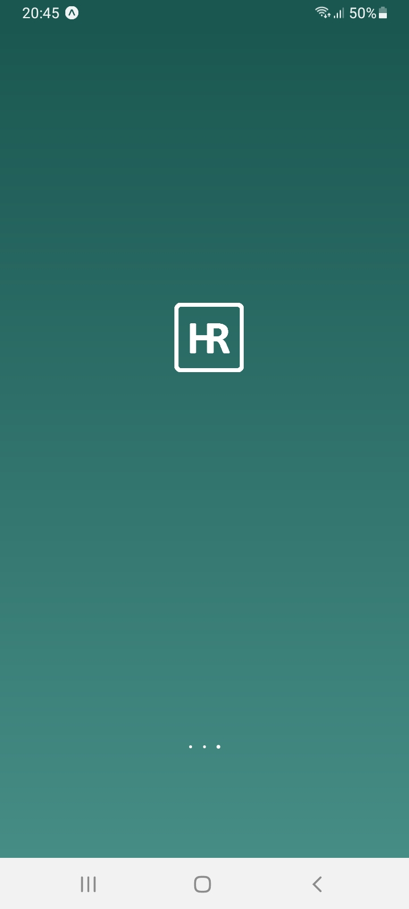
  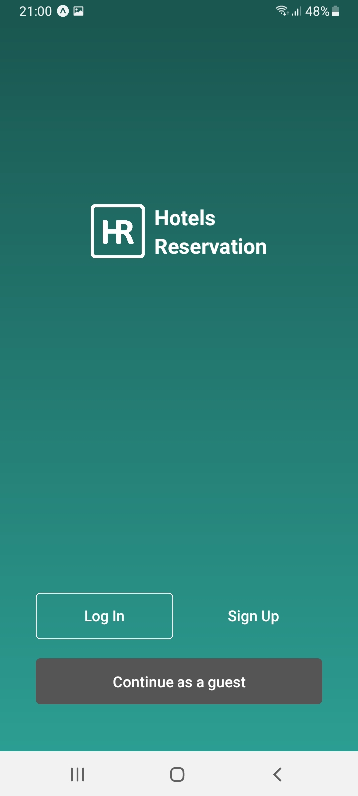
  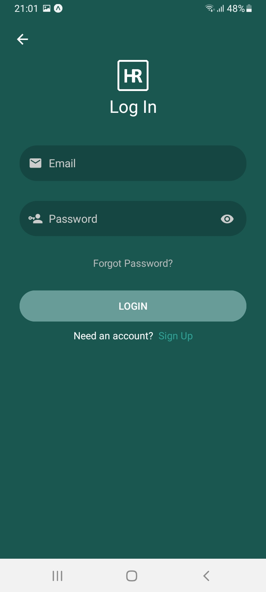
  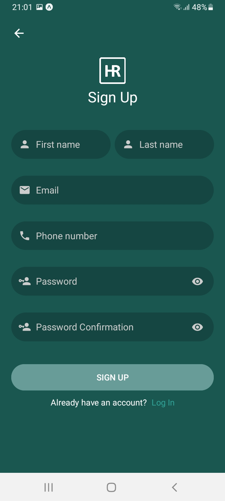
  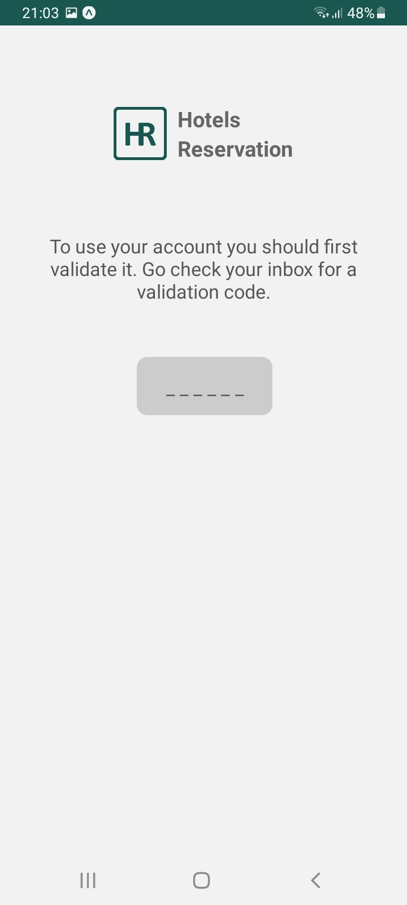
  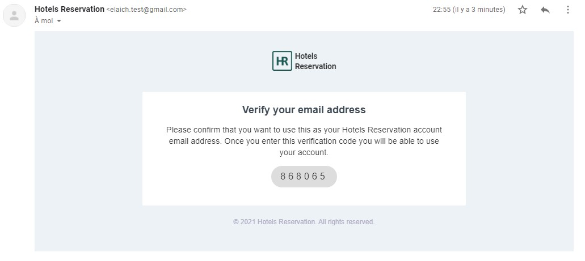
  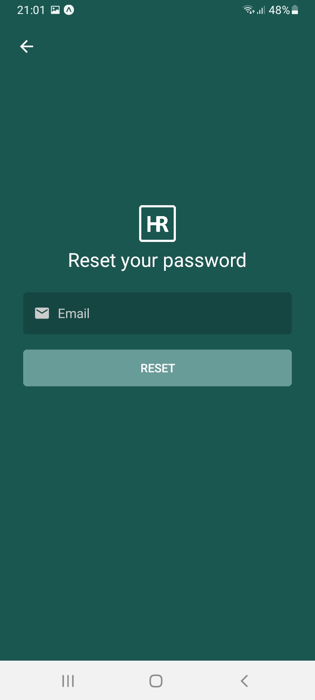
  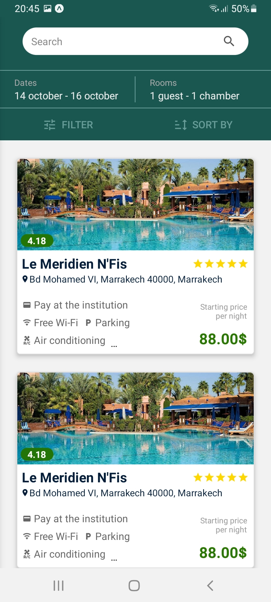
  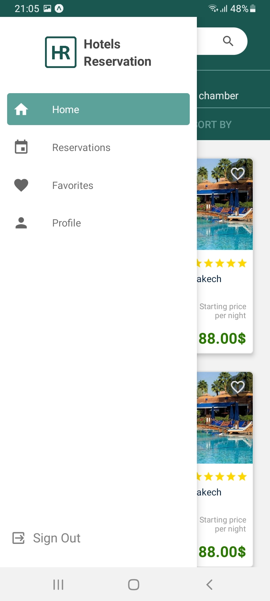
  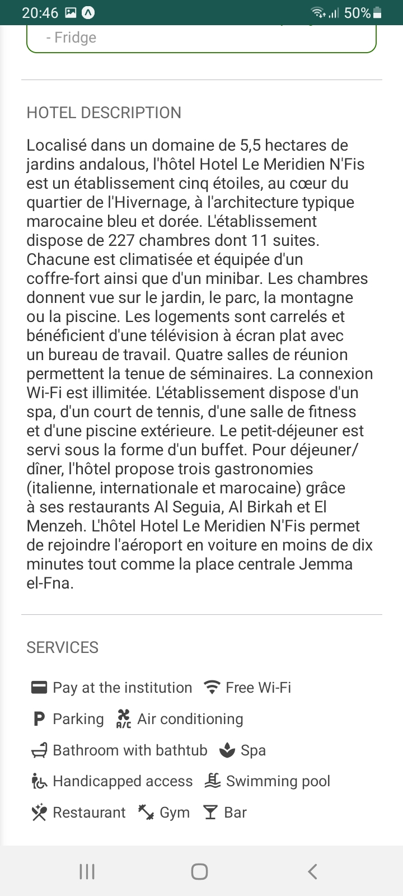
  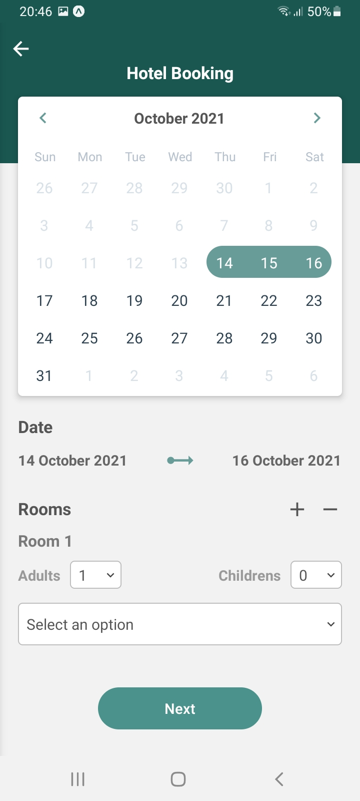
  
  

